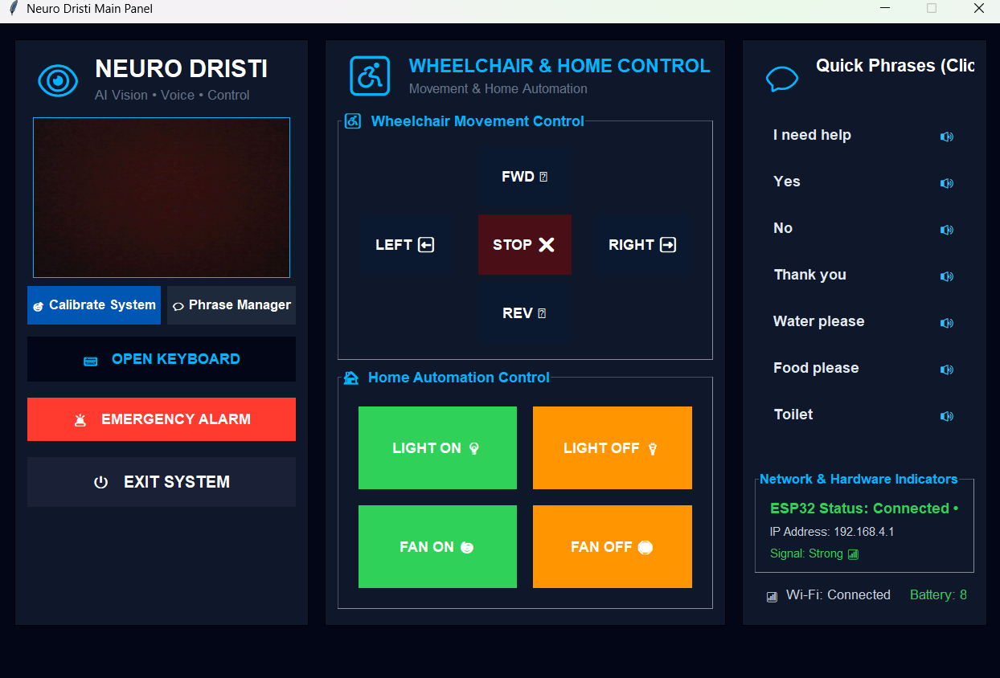
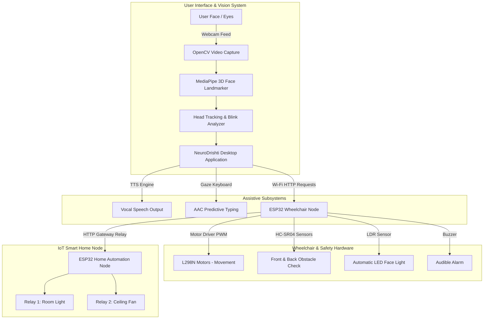

# NeuroDrishti: Eye-Controlled Smart Wheelchair & AAC Assistive System 🧠♿

[](https://www.python.org/)
[](https://developers.google.com/mediapipe)
[](https://opencv.org/)
[](https://www.espressif.com/)
[](LICENSE)

**NeuroDrishti** is an integrated hands-free assistive technology ecosystem designed to empower individuals with severe motor disabilities (such as ALS, quadriplegia, or spinal cord injuries). By fusing real-time computer vision, eye-tracking, head-gesture translation, micro-controller robotics, and IoT home automation, NeuroDrishti provides independent mobility, verbal communication, and environmental control through non-invasive facial gestures.

<p align="center">
  
</p>

---

## 🌟 Key Features

### 👁️ 1. Hands-Free Head & Eye Gesture Control
- **Facial Landmark Detection**: Powered by MediaPipe 3D Mesh Landmarking (478 facial points) for sub-millimeter tracking accuracy.
- **Head Orientation Steering**: Intuitive pitch and yaw head movements smoothly map to screen cursor positions.
- **Eye Blink & Dwell Click**: Firm blink detection (Eye Aspect Ratio thresholding) and dwell-time triggering for left, right, and double clicks.
- **Calibration Engine**: Built-in 5-point screen calibration tool for adaptive user workspace mapping.

### ♿ 2. Smart Wheelchair Locomotion & Safety
- **Wireless ESP32 Controller**: Low-latency Wi-Fi HTTP web server control (`WHEELCHAIR_CTRL` Access Point).
- **Dual Ultrasonic Collision Prevention**: Front and rear HC-SR04 ultrasonic sensors dynamically halt movement if obstacles are detected within 30cm.
- **Safety Watchdog Timer**: Auto-stop mechanism triggers if communication heartbeat is lost for more than 1.5 seconds.
- **Automatic Headlight System**: Integrated LDR (Light Dependent Resistor) sensor toggles ambient face lighting in low-light environments.
- **Audible Warning System**: Multi-stage buzzer warnings for proximity hazards.

### 🗣️ 3. AAC Speech Synthesizer & Predictive Virtual Keyboard
- **Text-to-Speech (TTS)**: Offline vocalization powered by `pyttsx3`.
- **Full-Screen Eye-Typing Station**: Virtual keyboard optimized for gaze/blink interaction with real-time text input display.
- **Smart Autocomplete**: 4-option predictive word completions based on common vocabulary.
- **Custom Phrase Manager**: Quick-select customizable phrases ("I need help", "Water please", etc.) stored in JSON format.

### 🏠 4. Integrated Smart Home Automation
- **Multi-Node ESP32 Wi-Fi Mesh Relay**: The wheelchair ESP32 acts as a gateway router to relay commands to a secondary Home Automation ESP32 node (`192.168.4.2`).
- **Appliance Control**: Direct control over room lights, fans, and auxiliary electrical devices straight from the software GUI or web portal.

---

## 📐 System Architecture



---

## 🛠️ Hardware Specifications & Wiring

### 1. ESP32 Wheelchair Controller (`Wheel_chair.ino`)

| Component | ESP32 Pin | Function |
| :--- | :--- | :--- |
| **L298N Motor Driver IN1** | GPIO 14 | Motor A Direction |
| **L298N Motor Driver IN2** | GPIO 27 | Motor A Direction |
| **L298N Motor Driver IN3** | GPIO 26 | Motor B Direction |
| **L298N Motor Driver IN4** | GPIO 25 | Motor B Direction |
| **L298N Enable A (ENA)** | GPIO 13 | Left Motor PWM Speed |
| **L298N Enable B (ENB)** | GPIO 12 | Right Motor PWM Speed |
| **Front Ultrasonic Trig** | GPIO 4 | Front Obstacle Trigger |
| **Front Ultrasonic Echo** | GPIO 16 | Front Distance Echo |
| **Back Ultrasonic Trig** | GPIO 17 | Back Obstacle Trigger |
| **Back Ultrasonic Echo** | GPIO 5 | Back Distance Echo |
| **Audible Warning Buzzer**| GPIO 22 | Obstacle / Alert Buzzer |
| **LDR Sensor Input** | GPIO 34 (Analog) | Ambient Light Level |
| **Face LED Light Output** | GPIO 32 | Night Lighting |

### 2. ESP32 Home Controller (`home_control.ino`)

| Component | ESP32 Pin | Function |
| :--- | :--- | :--- |
| **Relay Module 1** | GPIO 26 | Light Switch |
| **Relay Module 2** | GPIO 27 | Fan Switch |

---

## 📦 Repository Structure

```
NeuroDristi/
├── assets/
│   └── dashboard_preview.png # Application GUI screenshot preview
├── neurodristi.py            # Main Python application (CV, Eye Tracking, GUI, AAC, HTTP client)
├── Wheel_chair.ino           # ESP32 firmware for wheelchair motor control & safety sensors
├── home_control.ino          # ESP32 firmware for smart home automation node
├── requirements.txt          # Python package dependencies
├── .gitignore                # Git ignore rules for build artifacts
└── README.md                 # Project documentation
```

---

## 🚀 Getting Started

### Prerequisites

1. **Python 3.9+** installed on your system.
2. **Webcam** (built-in or USB external camera).
3. **Arduino IDE** (with ESP32 board support installed).

### Software Installation

1. Clone the repository:
   ```bash
   git clone https://github.com/sohancreation/NeuroDristi.git
   cd NeuroDristi
   ```

2. Install the required Python packages:
   ```bash
   pip install -r requirements.txt
   ```

3. Run the main application:
   ```bash
   python neurodristi.py
   ```
   > *Note: On first run, `neurodristi.py` will automatically download the required MediaPipe `face_landmarker.task` model file.*

### Hardware Setup

1. Open `Wheel_chair.ino` in Arduino IDE, select your ESP32 board, and flash the code.
2. Open `home_control.ino` in Arduino IDE and flash the secondary ESP32 node.
3. Power on both ESP32 modules. The Wheelchair ESP32 will broadcast a Wi-Fi Access Point named `WHEELCHAIR_CTRL` (Password: `12345678`).
4. Connect your PC / Laptop running `neurodristi.py` to the `WHEELCHAIR_CTRL` Wi-Fi network.

---

## 🎮 How to Use

1. **Launch Dashboard**: Click **START SYSTEM** on the main GUI dashboard.
2. **Calibrate**: Perform the 5-point gaze calibration if prompted.
3. **Locomotion Controls**:
   - Move your head up/down/left/right to guide the on-screen cursor onto movement buttons.
   - Firmly blink or dwell to trigger **FORWARD**, **LEFT**, **RIGHT**, or **BACKWARD**.
4. **Typing & AAC Speech**:
   - Hover and click on the floating blue keyboard icon (`⌨`) at the bottom right.
   - Select letters or pick from word autocomplete suggestions at the top.
   - Press `ENTER` or select preset phrases from the Phrase Manager to speak out loud.
5. **Home Appliances**:
   - Toggle **Light ON/OFF** and **Fan ON/OFF** buttons from the dashboard to control room electronics wirelessly.

---

## 🌐 API Reference (ESP32 Endpoints)

| Endpoint | Method | Description |
| :--- | :--- | :--- |
| `/F` | GET | Move Wheelchair Forward (Safety checked) |
| `/B` | GET | Reverse Wheelchair (Safety checked) |
| `/L` | GET | Turn Wheelchair Left |
| `/R` | GET | Turn Wheelchair Right |
| `/S` | GET | Emergency Stop |
| `/status` | GET | Returns JSON distance & alarm telemetry |
| `/home/light_on` | GET | Relays ON request to Home ESP32 (`/light/on`) |
| `/home/light_off` | GET | Relays OFF request to Home ESP32 (`/light/off`) |
| `/home/fan_on` | GET | Relays ON request to Home ESP32 (`/fan/on`) |
| `/home/fan_off` | GET | Relays OFF request to Home ESP32 (`/fan/off`) |

---

## 📄 License

This project is licensed under the MIT License - see the [LICENSE](LICENSE) file for details.

---

## 👨‍💻 Author

Developed with ❤️ by **[sohancreation](https://github.com/sohancreation)** for accessible mobility and assistive innovation.
